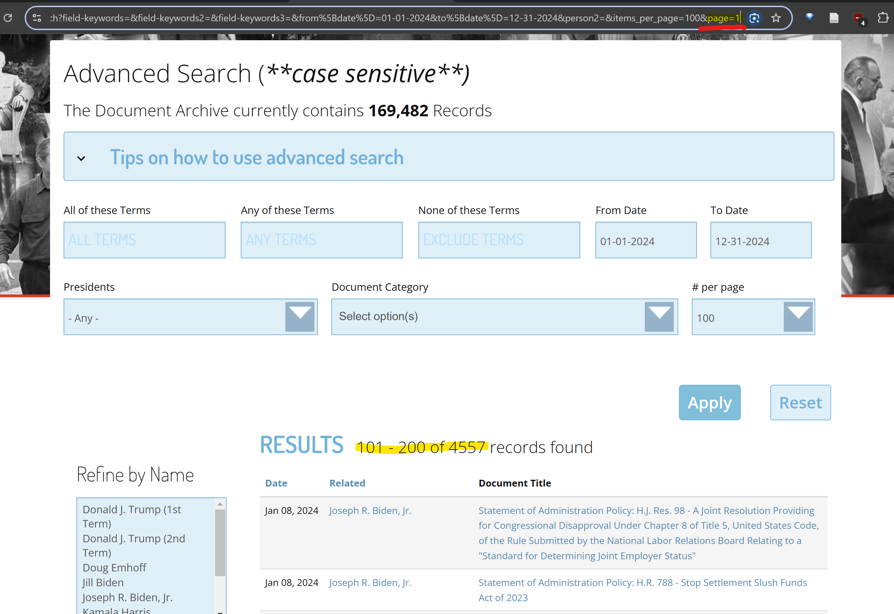

# Web Scraping Simplified

**Overview**

- Identify and explore the data source.
- Use browser developer tools to inspect and understand the website structure.
- Manipulate URL query parameters to efficiently access data.
- Prepare to automate the collection of links and content.
- Save the scraped data in a structured way.


## 1. Identifying the Data Source

Suppose you want to gather presidential speeches, debates, and related documents from specific years. [The American Presidency Project](https://www.presidency.ucsb.edu) is a suitable source.


- Visit the website. Look around to find out if it will be of any use.
- Notice the search function in the top right corner and click it.
- Use the search to filter results by date. Let's set the dates to cover the year 2000.
- After submitting the search, a list of links to relevant documents appears. Check them out.
- The links contain the texts that we'll want to scrape.
- For now, keep in mind that we'll somehow have to obtain a list containing them in order to visit them one by one automatically and get the data.


## 2. Exploring with Developer Tools

To understand how the website loads and displays data:

- Press `F12` to open Developer Tools.
- Go to the **Network** tab, then select **Fetch/XHR**.
- Reload the page (`Ctrl+R`) and scroll down to load more results.
- Inspect the network requests to see if the responses contain the document links.

If the links are not present in the network responses, switch to inspecting the HTML structure:

- Use the **Select Element** tool (top left in Dev Tools or `Ctrl+Shift+C`).
- Hover over a document link to locate its HTML element.
- Note the structure - typically, all result links are nested similarly.
- Observe that the links are partial (e.g., `documents/exchange-with-reporters-chappaqua-new-york`). You’ll need to combine these with the base URL in your script.


## 3. Manipulating Query Parameters

When you perform a search, the URL changes from
```
https://www.presidency.ucsb.edu/advanced-search
```

to something like:

```
https://www.presidency.ucsb.edu/advanced-search?field-keywords=&from[date]=01-01-2000&to[date]=12-31-2000&items_per_page=25
```


After the `?`, query params were added.

Notice the dates in the url. **Change these parts in the address bar.**
* What happens when you change the starting date year to `2003` and the ending date year to `2004`?
* What happens when you change the starting year to `2026` and the ending year to `2028`?
* What happens when you change the starting year to `2023` and the ending year to `2021`?

Notice what's at the end of this url - the `items_per_page` param. It would be useful for us to **display as many items on the page as possible** - that way, we won't have to go through more pages than needed to get all links from the desired time periods. Let's see what we can do about it.
* What happens when we change the number to `50`?
* What happens when we change the number to `0`?
* Since we would like a possibly large number, let's try `500` now. What happens?
* What happens when we change the number to `100`? (the maximum that's available normally when you click the blue '#per page' button)

As you can see from both the dates and the items_per_page example, some changes yield results, some not, and some throw errors. Either way, it's good to look around like that to know what possibilities there are. Now we know that the max `items_per_page` we can get is `100`. We'll use that in the script.

But how we'll we go though the pages displaying the links? Let's investigate the page a bit more. Click the next button at the bottom of the page.

Check out the url - it has changed again. There's a new param and value now: `page=1`.


* What happens when we change the number to `5`?
* What happens when we change the number to `1000`?
* What happens when we change the number to `0`?

Now we know that:
* the first page of result has the param value of `0` (`page=0`),
* we can visit a certain page by changing the param value, for example page 5 by changing the value to 5,
* and that, in this case, 1000 is too many because there aren't that many pages.

To sum up:

- **Dates:** Change the `from[date]` and `to[date]` parameters in the URL to adjust the time range.
- **Items per page:** Increase `items_per_page` to display more results per page (e.g., 100 is the maximum allowed).
- **Pagination:** After the first page, a `page` parameter appears (e.g., `page=1`). Adjust this to navigate through result pages.


## 4. Planning the Scraping Script

**Steps:**

- How many pages do we need to go thorugh to get all the results? Calculate the number of pages:
Divide the total number of results by 100 (max per page) and round up.
- For each page, construct the URL with the correct query parameters.
- For each result page, extract the partial links to the documents.
- Combine partial links with the base URL.
- Visit each document link and extract the main content.


## 5. Saving the Data

- Create an output directory for the scraped data.
- For each document, save the text to a uniquely named file.
- Optionally, append all texts to a single file for convenience.

---

## 6. Example Workflow for TAPP website

1. **Identify the total number of results** and calculate the number of pages needed.
2. **Generate URLs** for all result pages using the appropriate `from[date]`, `to[date]`, `items_per_page`, and `page` parameters.
3. **Extract document links** from each result page using BeautifulSoup or similar.
4. **Fetch and parse each document page** to extract the speech or report text.
5. **Save the extracted text** to files in your output directory.

---

## 7. Key Observations and Tips

- In the case of the exampple page, partial URLs for texts are given. They need to be combined with the site’s base URL.
- The maximum number of items per page is 100.
- Use developer tools to identify the HTML structure of links and content areas.
- In the script, be mindful of request frequency-add short delays to avoid overwhelming the server.
- Organize your output files and directories for easy access and analysis.

---

**Let's move on to scripting!**
Open `webscraping_simplified.py` and begin automating your data collection process.

[^1]: webscraping_simplified.md

[^2]: webscraping_simplified.py.py

